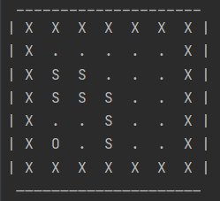

# Double Deep Q-Network for Snake - a toy experimentation project.

Using a **n-step Double Deep Q-Network (DDQN) with Experience Replay**, a snake learns how to eat apples by trial and errors.

---

Table of content
- [Preliminary note - Scope](#note)
- [Overview of Snake DDQN Game Setting](#setting)
- [Results](#results)
- [Good Ideas and Lessons For Next Time](#ideas)
- [Credits](#credits)

---

## Preliminary Note - Scope
<a name="note"/>

This project started with a two-player snake game setting and a logic inspired from [AlphaZero](https://deepmind.com/blog/article/alphazero-shedding-new-light-grand-games-chess-shogi-and-go). It evolved into **a toy project for getting a hang on concepts behind DDQN**.

The task is only partially solved, with sensible but non-optimal behavior achieved by the agent. Full optimization of training parameters would be tedious and time-consuming; it would require refactoring the code from scratch to be robust and trustworthy. 

As a result:

--> **This project is closed and I will not try to optimize further the metaparameters.**

--> **You may still be inspired by the n-step DDQN implementation in `arena.py`, the use of a target network with masking to improve training stability, or the few sources that I credit below.**

---

## Overview of Snake DDQN Game Setting 
<a name="setting"/>

- Small snake world (7x7), including borders on the sides
- Reward: 10 for apple, -20 for crash, -2 * distance to apple at each step
- 3-step Double Deep Q-Network
- Epsilon-policy of a softmax with temperature
- Probabilistic choice of experience to add to memory, based on level of reward of episode
- Parameters are in `main_1p.py`

---

## Results
<a name="results"/>

- `main_1p.py`
  - After 10,000 fittings steps: mean loss = 0.019
- `demonstrate_1p.py`
  - Evaluation on 30 games:
    - Median episode duration: 75.0 (--> games were cut at 75 if reward was below 2. -> the snake learnt not to crash!)
    - Median reward: 3.0
    - High score: 13
- `demonstrate_1p.py --mode game`
  - Example game board with a snake that ate 5 apples:

  

Authors in [Finnson & Morlo](https://www.diva-portal.org/smash/get/diva2:1342302/FULLTEXT01.pdf)
shows shows that average scores of ~30 apples could be achieved (although in a space 3 times the size of our ownn)
Simpler solutions include using custom features as in this [article (2019)](https://towardsdatascience.com/why-going-from-implementing-q-learning-to-deep-q-learning-can-be-difficult-36e7ea1648af)
from Ray Heberer, although limited in potential.

---

## Good Ideas and Lessons For Next Time
<a name="ideas"/>

Reinforcement Learning:
- Go beyond Deep Q-Network with Double Deep Q-Network and Experience Replay.
- Go beyond 1-step Q-Network with n-step Q-Network, but be aware of the resulting complexity.
- Use standard reinforcement learning libraries like `gym`; it makes a more modular implementation.

Code
- Use `black` for assuring PEP-8 convention compliance saves a huge amount of time.
- Start first by considering the existing literature to get a sense of feasibility e.g. [Finnson & Morlo](https://www.diva-portal.org/smash/get/diva2:1342302/FULLTEXT01.pdf)
- Start by a simpler problem : 1-player before the harder 2-player snake game; cartpole before snake game.
- Save model's weights frequently along learning, to be able to resume learning in another session.

---

## Credits
<a name="credits"/>

- Sutton and Barto's [Reinforcement Learning: An Introduction](http://incompleteideas.net/book/RLbook2020.pdf)
for pseudo-code of n-step SARSA logic.
- The [article (2019)](https://towardsdatascience.com/why-going-from-implementing-q-learning-to-deep-q-learning-can-be-difficult-36e7ea1648af)
from Ray Heberer for ideas related to Double Deep Q-Network.
- This [article (2020)](https://towardsdatascience.com/snake-played-by-a-deep-reinforcement-learning-agent-53f2c4331d36)
from Hennie de Harderr for the idea of rewarding getting closer to the apple.
- The team behind [alpha-zero-general](https://github.com/suragnair/alpha-zero-general/),
which greatly inspired this repository structure and classes, at least at the beginning.

